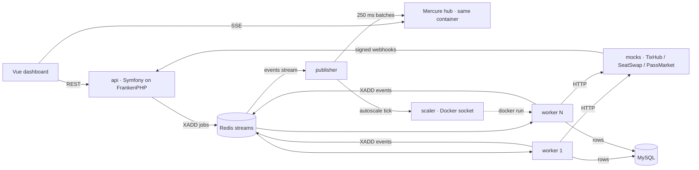

# Turnstile

A bulk ticket sync engine. One bulk action on a 4,280-seat arena fans out into thousands of jobs, a pool of PHP workers pushes them to three flaky mock marketplaces, and a Vue dashboard shows every seat, worker and retry live.

It exists to show how I handle async workloads: fan-out, retries with backoff, per-platform rate limiting, idempotency, optimistic locking, dead letters with retry, and horizontal worker scaling (manual and automatic) with honest throughput numbers.

**How it was built:** With Claude Code doing most of the typing, over about 2 days. The architecture, the six guarantees below, the tradeoffs below, and the review of every change were mine; the code was read, run, and fixed by me. I’m happy to walk through any file.

## Run it

```bash
docker compose up
```

Then open <http://localhost:5173>. First boot builds the images, runs migrations and seeds the arena. Nothing else to install; `.env.example` only documents the defaults baked into `compose.yaml`, with one you may want to change first (next section).

### Sizing it to your machine

`MAX_WORKERS` (default 32) is the one ceiling for the **+** stepper, **Auto** and the `scaler` sidecar. Every worker is its own PHP container and Auto climbs toward the ceiling under a deep queue, so on a laptop with Docker Desktop's default memory limit 32 can starve the machine. Past about 15 workers the shared rate-limit bucket is the ceiling anyway (see Numbers), so a lower number costs the demo nothing.

Set it before the first `docker compose up`, roughly one worker per CPU core:

```bash
cp .env.example .env   # then edit MAX_WORKERS
```

Or for a single run: `MAX_WORKERS=8 docker compose up`.

To raise or lower it later, edit `.env` and run:

```bash
docker compose up -d
```

Compose sees the changed env and recreates `api`, `worker`, `publisher` and `scaler`; MySQL and Redis stay up and keep their data. The stepper and Auto read the new ceiling from the API on the next snapshot, and the API answers a manual scale above it with a 422. If the scaler had started extra workers, `docker compose down` first gives you a clean pool.

| Port | What |
|---|---|
| 5173 | Dashboard (Vite dev server) |
| 8080 | API and the Mercure hub at `/.well-known/mercure` |
| 8090 | Mock marketplaces, handy for `curl` |

Try it: pick sections on the map, choose **Transfer → TixHub**, press Start. Drag **Chaos** to 60% mid-run and watch retries, backoff and dead letters appear. Press **+** on the Workers tab to start real containers.

## Architecture



Two data paths. MySQL is the truth: runs, jobs, attempts, tickets, the idempotency ledger. Redis is the fast lane: one Messenger stream per platform, rate-limit buckets, worker heartbeats, and an `events` stream that the publisher folds into Mercure batches every 250 ms so a 40 jobs/s run does not push 400 SSE frames a second at the browser.

| Service | Image | Role |
|---|---|---|
| `api` | `docker/api` | HTTP API, Mercure hub, migrations and seed on first boot |
| `worker` ×N | `docker/api` | `messenger:consume` on the five streams, same image as the API |
| `publisher` | `docker/api` | Folds the event stream into Mercure topics, runs the autoscale tick |
| `mocks` | `docker/mocks` | Three fake marketplaces with latency, 429s, chaos, idempotency replay and buyer snipes |
| `scaler` | `docker/scaler` | `POST /scale {"workers": n}` clones or stops worker containers |
| `mysql`, `redis` | official | Storage |
| `web` | `docker/web` | Vite dev server |

## The six guarantees and where they live

1. **Fan-out.** `POST /api/runs` inserts one `runs` row and dispatches a single `RunStarted` message. [`FanOutHandler`](apps/api/src/Application/Run/FanOutHandler.php) bulk-inserts jobs 1,000 at a time and dispatches one `ProcessTicketJob` per ticket onto the stream for its platform. The HTTP request returns in milliseconds whether the run has 100 jobs or 100,000.

2. **Retries with backoff.** [`JitteredRetryStrategy`](apps/api/src/Infrastructure/Messenger/JitteredRetryStrategy.php): 1, 2, 4, 8 s with ±25% jitter, five attempts, then dead letter. Timeouts, 5xx and 429s raise [`PlatformRetryableException`](apps/api/src/Application/Job/Exception/PlatformRetryableException.php); a 4xx the vendor will never accept raises `PlatformRejectedException` and goes straight to the dead-letter state. Every attempt is a `job_attempts` row, which is what the trace popover on the Failed tab reads.

3. **Rate limiting.** [`ClientRateLimiter`](apps/api/src/Application/Platform/ClientRateLimiter.php) keeps a Symfony token bucket per platform in Redis, sized at 80% of the vendor's limit (40 tokens/s with a 200 burst at the default 3,000 rpm). The bucket is shared by every worker, so adding workers raises throughput only until the bucket is the ceiling, and the platform gauges show exactly that moment. The **Vendor limit** slider changes what the mocks enforce; with **Pace to limit** on the buckets follow it and you never see a 429, with it off the workers keep their pace, the vendors answer 429 with `Retry-After`, and the backoff rings show on the map.

4. **Idempotency.** Two layers, because each guards a different side. [`Ledger`](apps/api/src/Application/Job/Ledger.php) is a `ticket_actions` row unique on `(ticket_id, run_id)`: a redelivered or replayed job finds it and skips. The vendor gets a deterministic `Idempotency-Key` of `uuid5(runId, "ticket:{id}:{action}")`, so a retried attempt after a timeout returns the cached response instead of listing the ticket twice. **Replay 500** re-dispatches the last 500 completed jobs and the Events tab shows 500 skips and zero vendor calls.

5. **Optimistic locking.** Every ticket write is `UPDATE tickets SET ... WHERE id = ? AND version = ?` ([`TicketRepository::apply`](apps/api/src/Application/Job/TicketRepository.php)). The mocks simulate buyers who snipe a listing and deliver an HMAC-signed webhook ([`WebhookController`](apps/api/src/Http/WebhookController.php)) that bumps the version. A worker that loses the race gets `LockConflictException`, re-reads, and either retries or skips because the ticket is now sold. Two writers, one row, nobody overwrites anybody. The webhook secrets are derived from a fixed string in the seeder so the mocks can sign without configuration; in production each platform's secret is per-tenant config and never in source.

6. **Dead letters with retry.** Exhausted jobs land in `jobs.status = dead_lettered` with the reason and attempt count, which the Failed tab lists with per-row Retry and Retry all ([`RunControl`](apps/api/src/Application/Run/RunControl.php)). Messenger's own `failed` transport stays configured as a safety net for anything that escapes the handler.

Pause, resume and cancel are flags on the run ([`RunFlags`](apps/api/src/Application/Run/RunFlags.php)) that the handler checks before every job; a paused job re-queues itself with a 2 s delay, a cancelled one marks itself and acks.

## Scaling

The **+ / −** stepper on the Workers tab calls `POST /api/workers/scale`. The API forwards to the `scaler` sidecar, which inspects one running worker and starts clones with the same image, env, command, networks, mounts and compose labels ([`apps/scaler/src/Docker.php`](apps/scaler/src/Docker.php)). Scale-down stops the newest containers with a 15 s grace so in-flight jobs finish. Cards appear on the dashboard as the new workers' heartbeats arrive. A manual scale switches **Auto** off, so the autoscaler cannot undo it; `docker compose up -d --scale worker=8` works too once Auto is off, otherwise the idle scale-down trims the extra containers within a tick.

**Auto** hands control to [`AutoscalePolicy`](apps/api/src/Application/Scaling/AutoscalePolicy.php), ticked every 5 s by the publisher: more than 25 queued jobs per worker adds four every 5 s up to `MAX_WORKERS`; an idle queue removes two per tick down to two. Each decision is pushed as an `autoscale.decision` event and shown next to the toggle.

The Docker socket mount is **demo only**. A container with the socket is root on the host. The scale, autoscale and reset endpoints require `X-Admin-Token` (`ADMIN_TOKEN` in `.env`, a demo default) on top of the Origin check, so nothing on the LAN can reach the socket through the API. In production this is a Kubernetes HPA or KEDA scaler on the same queue-depth signal, and the `ScalerClientInterface` is the seam where that swap happens.

## Numbers (one laptop, ~200 ms mock latency)

Two levers set the ceiling, and the dashboard shows which one you are hitting:

- **Workers**, 2 to 32 (`MAX_WORKERS`, default 32), by the stepper or by Auto. Each worker does roughly one call per 200 ms, so throughput grows about 5 jobs/s per worker until the bucket wins.
- **Vendor limit**, the slider on the Platforms panel, 300 to 6,000 rpm (5 to 100 calls/s per marketplace, default 3,000 rpm = 50/s). With **Pace to limit** on, workers share a token bucket at 80% of that: 40 calls/s at the default, 4/s at the floor, 80/s at the top. With it off, the bucket stays at the default 40/s and a lower vendor limit produces real 429s, backoff and dead letters.

Measured at the default limit, pacing on:

| Workers | Jobs/s | Note |
|---|---|---|
| 2 | ~5 | default |
| 4 | ~11 | |
| 15 | ~42 | the 40 tokens/s bucket is now the ceiling; more workers only deepen the queue |

Push the slider up and the same 15 workers climb with it until the next ceiling, their own 200 ms latency. Pull it down and the gauges go flat at the new rate within a few seconds. Every number on screen comes from the same counters, so the header, tiles, Events tab and the mocks' `/admin/{platform}/stats` agree.

## Tradeoffs made for a quick demo

- **Own dead-letter state vs Messenger's failed transport.** The UI needs reason, attempt count and a retry button per job. Messenger's failed transport has none of that queryable, so the job row carries it and the transport is only a backstop.
- **Redis Streams vs RabbitMQ.** Redis was already needed for the limiter and heartbeats. The cost: delayed retries re-enter at the tail of the stream, so under a deep backlog a 1 s backoff is effectively "wait for the queue". RabbitMQ's delayed exchange or SQS visibility timeouts fix that.
- **A custom retry exception contract.** Messenger retries anything implementing `RecoverableExceptionInterface` forever, ignoring `max_retries`. The handler throws [`RetryDelayAwareException`](apps/api/src/Application/Job/Exception/RetryDelayAwareException.php) instead and the strategy honours the attempt cap.
- **Events via XADD from the handler, not an outbox.** A worker that dies between the DB commit and the XADD loses one dashboard event, never a ticket write; the next metrics snapshot is rebuilt from the tables anyway.

## At production scale

- Kubernetes with KEDA on stream depth instead of a socket-mounted sidecar.
- RabbitMQ or SQS with native DLQ policies and real delayed delivery.
- An outbox table so the ticket write and its event are one transaction.
- Partition `tickets` and `jobs` by event; archive completed runs.
- Per-tenant rate limiters and per-platform circuit breakers.
- Mercure hub as its own deployment with per-subscriber JWTs; auth and audit on runs.
- A production front-end build (`vite build` behind Caddy) instead of the dev server.

## Development

```bash
docker compose exec api composer stan    # PHPStan, level max
docker compose exec api composer cs      # php-cs-fixer
docker compose exec api composer test    # PHPUnit
docker compose exec web npm run typecheck
docker compose exec web npm run lint       # ESLint
docker compose exec web npm test           # Vitest
```

`apps/api` is Symfony 7.4 on PHP 8.5, strictly typed, with one `PlatformClientInterface` implementation per marketplace. `apps/web` is Vue 3 with TypeScript strict, Pinia stores, and the seat map on a two-layer canvas with typed arrays and dirty-seat redraws (it was built and tested at 100k seats before the layout was shrunk to match the design). `apps/mocks` is dependency-free PHP so the latency, limits and chaos are enforced where a real third party would enforce them.

Platform names are fictional. Nothing here targets a real marketplace.
